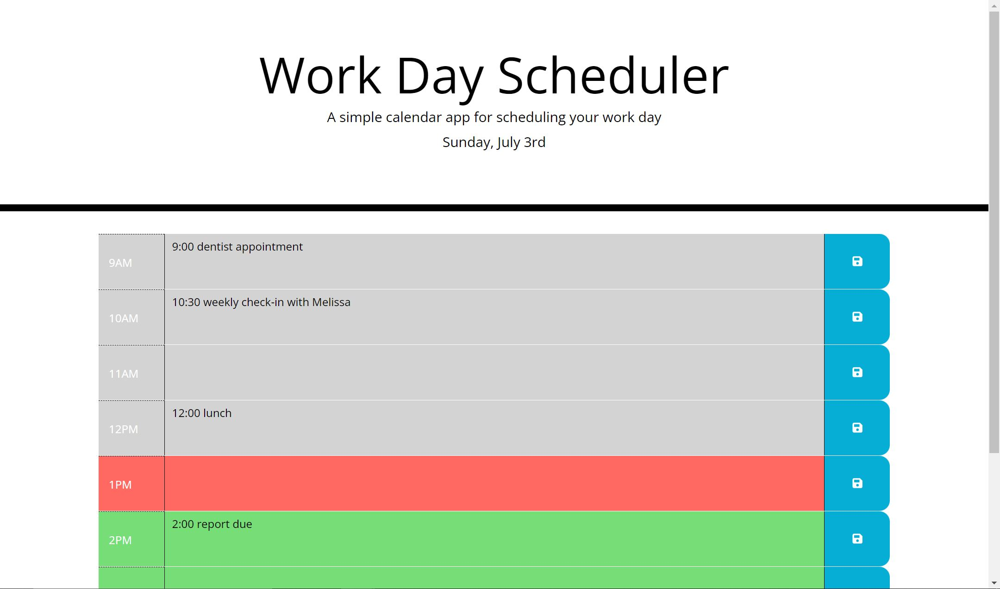

# Work Day Scheduler Starter Code

*Work Day Scheduler screenshot*

## About

I was asked to script functionality for a web-based day planner that gives the user the ability to edit and save calendar events that persist through page refreshes using local storage. Each hour block is styled dynamically to clearly indicate which events have passed, which are still to come, and which are in the current hour. The page checks the time at regular intervals and updates the UI automatically. The page uses Bootstrap to resize for any viewport window.

A basic header, a handful of CSS style rules, and some suggested CDN links were provided, but all Javascript and JQuery and the additional HTML and CSS were developed as part of the challenge.

## Contact

Brett Piper - <bpiper91@gmail.com>

Deployed project: <https://bpiper91.github.io/workday-scheduler>

GitHub repository: <https://github.com/bpiper91/workday-scheduler>